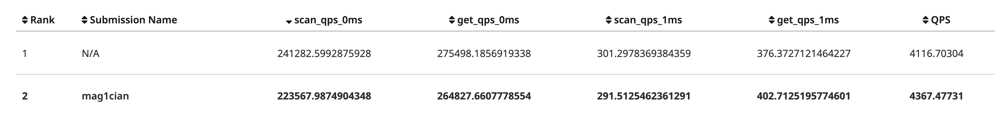

# Task #1 - LRU-K Replacement Policy

确定lru-k算法，节点访问没到k次时，按照lru，满k次之后按照比较max k distance，我的实现是std::list记录frame_id 之后每次遍历按照规则搜索，复杂度是O(n)。

# Task #2 - Buffer Pool Manager

FetchPage 和 NewPage时，注意记录pin_count    
由于std::mutex 不是可重入锁, FlushAllPages 里不要用FlushPage。    
page被修改过了，那就一直是dirty的，直到它被flush，`is_dirty_ |= is_dirty`  
DeletePage 记得要用Deallocate,不然gradescope会memeory leak 。

# Task #3 - Read/Write Page Guards

值得注意的是要move assignment的时候要判断 &that 是不是 this  
加锁如果放在构造函数内，要判断page是不是nullptr。

# Leaderboard Task (Optional)
2023/06/23  

2023/06/25

gradescope有bug吧我什么优化都没做....  
TODO
